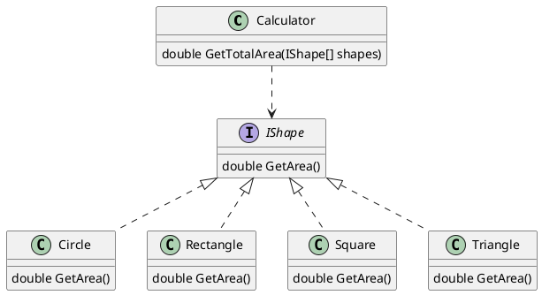

Area Calculations
===
[Link](https://www.codewars.com/kata/5702e2f380b8c86df3000003)
Implement a calculator for shapes, like Square, Rectangle, Circle and Triangle.
The calculator have 2 interfaces ```decimal GetTotalArea(...shapes)```


